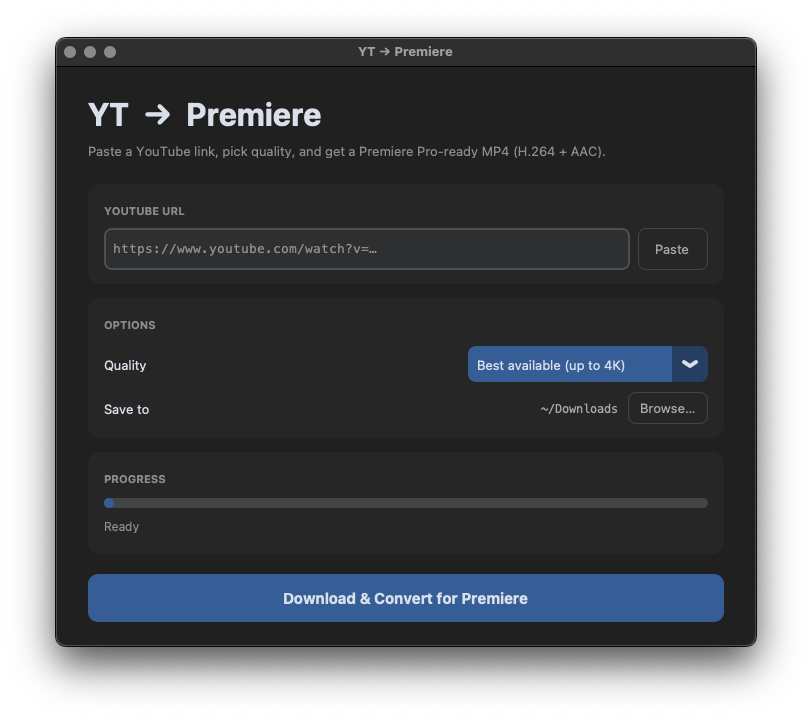

<p align="center">
  
</p>

<h1 align="center">YT → Premiere</h1>

<p align="center">
  <strong>Download any YouTube clip. Get a file that <em>just works</em> in Premiere Pro.</strong>
</p>

<p align="center">
  <a href="#quick-start"></a>
  
  
  
</p>

<p align="center">
  No codec headaches &nbsp;·&nbsp; No missing audio &nbsp;·&nbsp; No <em>"unsupported compression type"</em> errors<br/>
  Paste a link → pick quality → get a proper <strong>H.264 + AAC MP4</strong> ready for your timeline.
</p>

---

<br/>

## 🎬 The problem

YouTube now serves videos in modern codecs like **AV1** and **Opus**.  
Browsers play them fine — but **Premiere Pro, Final Cut, and QuickTime** choke on them:

```
❌  "File uses unsupported video compression type av01"
❌   Video imports but audio is missing
❌   QuickTime says the file is corrupted
```

<table>
  <tr>
    <th>😤 What YouTube sends</th>
    <th>✅ What Premiere needs</th>
  </tr>
  <tr><td>AV1 / VP9 video</td><td><strong>H.264 (AVC)</strong> video</td></tr>
  <tr><td>Opus audio</td><td><strong>AAC</strong> audio</td></tr>
  <tr><td>WebM container</td><td><strong>MP4</strong> container</td></tr>
</table>

**YT → Premiere** fixes this automatically.

<br/>

## ✨ Features

🎯 **Premiere-ready output** — H.264 + AAC in MP4, every time  
📐 **Quality picker** — 4K, 1080p, 720p, 480p, or audio-only MP3  
⚡ **Smart conversion** — only re-encodes what's needed; copies the rest  
🌙 **Dark mode UI** — modern look, native feel on macOS  
📋 **One-click paste** — grabs the URL straight from your clipboard  
📊 **Live progress** — download speed, ETA, and progress bar  

<br/>

## 🚀 Quick start

> **You need 2 things on your Mac:**  
> 1. **Python 3.10+** — check with `python3 --version`  
> 2. **ffmpeg** — `brew install ffmpeg` &nbsp; *(install [Homebrew](https://brew.sh) first if you don't have it)*

<br/>

### 1️⃣ &nbsp; Clone & install

```bash
git clone https://github.com/arvindjuneja/yt2premiere.git
cd yt2premiere

python3 -m venv venv
source venv/bin/activate
pip install -r requirements.txt
```

### 2️⃣ &nbsp; Run

```bash
source venv/bin/activate
python3 app.py
```

Or just:

```bash
./run.sh
```

<br/>

## 🖥️ How to use

| Step | Action |
|:---:|---|
| **1** | Copy a YouTube URL in your browser |
| **2** | Click **Paste** in the app |
| **3** | Pick your quality from the dropdown |
| **4** | Hit **Download & Convert for Premiere** |
| **5** | Import the MP4 into Premiere — it just works ✅ |

<br/>

## 🔧 How it works

```
 YouTube URL
      │
      ▼
 ┌─────────┐
 │  yt-dlp  │ ── downloads best available streams
 └────┬────┘
      │
      ▼
 ┌──────────┐
 │ ffprobe  │ ── checks video & audio codecs
 └────┬────┘
      │
      ├── both H.264 + AAC? ─────────► done! (no re-encode, instant)
      │
      ├── video ok, audio is Opus? ──► convert audio only (fast)
      │
      └── video is AV1/VP9? ─────────► re-encode video + audio
                                               │
                                               ▼
                                   ┌─────────────────────┐
                                   │  H.264 + AAC  MP4   │
                                   │  Premiere Pro ready  │
                                   └─────────────────────┘
```

<br/>

## 🧱 Built with

| | Tool | Role |
|---|---|---|
| 📥 | [**yt-dlp**](https://github.com/yt-dlp/yt-dlp) | Downloads streams from YouTube |
| 🎞️ | [**ffmpeg**](https://ffmpeg.org/) / ffprobe | Codec detection & H.264 + AAC re-encoding |
| 🎨 | [**CustomTkinter**](https://github.com/TomSchimansky/CustomTkinter) | Modern dark-mode GUI |
| 🐍 | **Python 3.10+** | Ties everything together |

<br/>

## 🩹 Troubleshooting

<details>
<summary><strong>"No module named '_tkinter'"</strong></summary>

Install Tk bindings for your Python version, then recreate the venv:

```bash
brew install python-tk@3.13   # match your python version
rm -rf venv
python3 -m venv venv
source venv/bin/activate
pip install -r requirements.txt
```

</details>

<details>
<summary><strong>SSL certificate errors</strong></summary>

Use Homebrew's Python instead of the python.org standalone installer:

```bash
/opt/homebrew/bin/python3 -m venv venv
source venv/bin/activate
pip install -r requirements.txt
```

</details>

<details>
<summary><strong>Conversion is slow on long videos</strong></summary>

That's normal — ffmpeg re-encodes video to H.264 which is CPU-intensive.  
For a 5-minute 1080p clip, expect ~30–60 seconds depending on your Mac.  
Short clips convert in a few seconds.

</details>

<br/>

## 📄 License

MIT — use it however you want.
