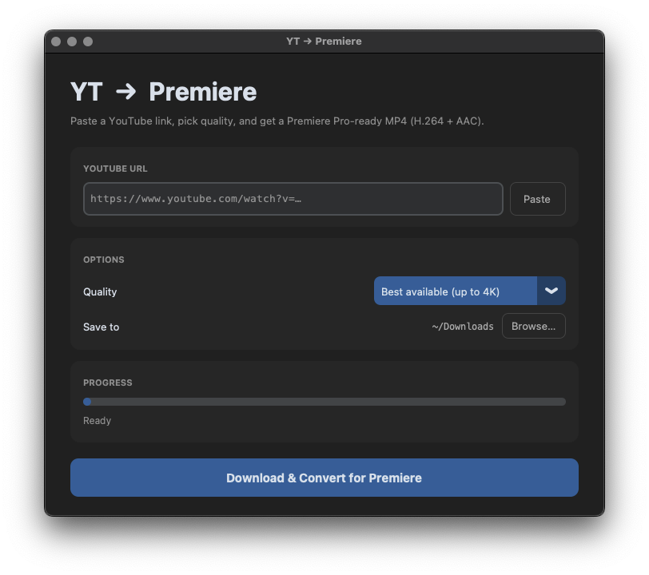

<p align="center">
  
</p>

<h1 align="center">YT → Premiere</h1>

<p align="center">
  <strong>Download any YouTube clip. Get a file that <em>just works</em> in Premiere Pro.</strong>
</p>

<p align="center">
  <a href="#quick-start"></a>
  <a href="#quick-start"></a>
  
  
  
</p>

<p align="center">
  No codec headaches &nbsp;·&nbsp; No missing audio &nbsp;·&nbsp; No <em>"unsupported compression type"</em> errors<br/>
  Paste a link → pick quality → get a proper <strong>H.264 + AAC MP4</strong> ready for your timeline.<br/>
  <strong>Bulk-friendly:</strong> drop in a whole list of links and let the queue run.
</p>

---

<br/>

## 🎬 The problem

YouTube now serves videos in modern codecs like **AV1** and **Opus**.  
Browsers play them fine — but **Premiere Pro, Final Cut, and QuickTime** choke on them:

```
❌  "File uses unsupported video compression type av01"
❌   Video imports but audio is missing
❌   QuickTime says the file is corrupted
```

<table>
  <tr>
    <th>😤 What YouTube sends</th>
    <th>✅ What Premiere needs</th>
  </tr>
  <tr><td>AV1 / VP9 video</td><td><strong>H.264 (AVC)</strong> video</td></tr>
  <tr><td>Opus audio</td><td><strong>AAC</strong> audio</td></tr>
  <tr><td>WebM container</td><td><strong>MP4</strong> container</td></tr>
</table>

**YT → Premiere** fixes this automatically.

<br/>

## ✨ Features

🎯 **Premiere-ready output** — H.264 + AAC in MP4, every time  
📦 **Bulk queue** — paste 1 or 100 links; one bad link never kills the batch  
⚡ **Zero re-encode by default** — grabs YouTube's own H.264 + AAC streams, so most files are an instant remux  
📐 **Quality picker** — 4K, 1080p, 720p, 480p, or audio-only MP3  
🌙 **Light & dark UI** — modern look, native feel on macOS & Windows  
📋 **One-click paste** — pulls every link out of your clipboard, bullet lists and all  
📊 **Live progress** — per-file speed and ETA plus an overall queue bar  
🛑 **Cancel any time** — stops the current file and skips the rest  

<br/>

## 🚀 Quick start

### macOS

> **You need 3 things on your Mac:**
> 1. **Python 3.10+** — check with `python3 --version`
> 2. **ffmpeg** — `brew install ffmpeg` &nbsp; *(install [Homebrew](https://brew.sh) first if you don't have it)*
> 3. **A JavaScript runtime** — `brew install deno` &nbsp; *(Node or Bun work too)*

```bash
git clone https://github.com/arvindjuneja/yt2premiere.git
cd yt2premiere

python3 -m venv venv
source venv/bin/activate
pip install -r requirements.txt
python3 app.py          # or: ./run.sh
```

### Windows

> **You need 3 things on your PC:**
> 1. **Python 3.10+** — download from [python.org](https://www.python.org/downloads/) &nbsp; *(check "Add python.exe to PATH" during install)*
> 2. **ffmpeg** — download from [gyan.dev](https://www.gyan.dev/ffmpeg/builds/) or install with `winget install Gyan.FFmpeg`
> 3. **A JavaScript runtime** — `winget install DenoLand.Deno` &nbsp; *(Node or Bun work too)*

```cmd
git clone https://github.com/arvindjuneja/yt2premiere.git
cd yt2premiere

python -m venv venv
venv\Scripts\activate
pip install -r requirements.txt
python app.py           REM or: run.bat
```

> **Why the JavaScript runtime?** YouTube signs its stream URLs with a JS challenge.
> Without a runtime available, downloads fail with `HTTP Error 403: Forbidden` on some
> videos and are heavily throttled on the rest. The app detects `deno`, `node`, `bun`,
> or `quickjs` automatically and warns you on launch if none is present.

<br/>

## 🖥️ How to use

| Step | Action |
|:---:|---|
| **1** | Copy one or more YouTube URLs — a plain list, a markdown bullet list, anything |
| **2** | Click **Paste** in the app (links get extracted and de-duplicated for you) |
| **3** | Pick your quality from the dropdown |
| **4** | Hit **Download & Convert for Premiere** |
| **5** | Import the MP4s into Premiere — they just work ✅ |

The counter above the box shows how many links were recognised, so you can sanity-check
the batch before starting. If a link fails, the queue carries on and you get a summary
of what broke at the end. `Cmd`/`Ctrl` + `Enter` starts the queue from the keyboard.

<br/>

## 🔧 How it works

```
 List of YouTube URLs
      │
      ▼
 ┌─────────┐
 │  yt-dlp  │ ── prefers YouTube's own avc1 + mp4a streams
 └────┬────┘
      │
      ▼
 ┌──────────┐
 │ ffprobe  │ ── checks video & audio codecs
 └────┬────┘
      │
      ├── both H.264 + AAC? ─────────► done! (no re-encode, instant)
      │
      ├── video ok, audio is Opus? ──► convert audio only (fast)
      │
      └── video is AV1/VP9? ─────────► re-encode video + audio
                                               │
                                               ▼
                                   ┌─────────────────────┐
                                   │  H.264 + AAC  MP4   │
                                   │  Premiere Pro ready  │
                                   └─────────────────────┘
```

**Why the H.264 preference matters:** YouTube publishes the same video as AV1/VP9 *and*
as H.264 up to 1080p. Asking for "best" lands you on AV1 + Opus, which means a slow,
lossy, CPU-bound re-encode of every single file. Asking for the H.264 variant up front
skips that entirely — the files already arrive in the codec Premiere wants.

Untick **Prefer YouTube's H.264 streams** when you specifically need 1440p or 4K; those
resolutions are AV1/VP9 only, so they will be re-encoded.

<br/>

## 🧱 Built with

| | Tool | Role |
|---|---|---|
| 📥 | [**yt-dlp**](https://github.com/yt-dlp/yt-dlp) | Downloads streams from YouTube |
| 🎞️ | [**ffmpeg**](https://ffmpeg.org/) / ffprobe | Codec detection & H.264 + AAC re-encoding |
| 🟩 | [**Deno**](https://deno.com/) / Node / Bun | Solves YouTube's JS challenge for stream URLs |
| 🎨 | [**CustomTkinter**](https://github.com/TomSchimansky/CustomTkinter) | Modern dark-mode GUI |
| 🐍 | **Python 3.10+** | Ties everything together |

<br/>

## 🩹 Troubleshooting

<details>
<summary><strong>"HTTP Error 403: Forbidden", or downloads crawling at a fraction of your line speed</strong></summary>

Two causes, both easy to fix.

**1. No JavaScript runtime.** YouTube signs its stream URLs with a JS challenge. If
yt-dlp can't run JS it falls back to a client whose URLs get rejected (403) or throttled
hard:

```bash
brew install deno                 # macOS
winget install DenoLand.Deno      # Windows
```

**2. Stale yt-dlp.** YouTube changes things constantly; a build more than a couple of
months old will start failing:

```bash
pip install --upgrade yt-dlp
```

</details>

<details>
<summary><strong>Some links in my batch failed</strong></summary>

The queue is deliberately fault-tolerant — it finishes everything it can, then shows a
summary listing each failed URL with its reason. Fix those and paste just the failures
back in for a second pass. Private and age-restricted videos can't be downloaded
without credentials.

</details>

<details>
<summary><strong>"No module named '_tkinter'"</strong></summary>

**macOS** — install Tk bindings for your Python version, then recreate the venv:

```bash
brew install python-tk@3.13   # match your python version
rm -rf venv
python3 -m venv venv
source venv/bin/activate
pip install -r requirements.txt
```

**Windows** — reinstall Python from [python.org](https://www.python.org/downloads/) and make sure **tcl/tk and IDLE** is checked in the optional features step.

</details>

<details>
<summary><strong>SSL certificate errors</strong></summary>

**macOS** — use Homebrew's Python instead of the python.org standalone installer:

```bash
/opt/homebrew/bin/python3 -m venv venv
source venv/bin/activate
pip install -r requirements.txt
```

**Windows** — this usually means an outdated Python install. Update to the latest 3.x from [python.org](https://www.python.org/downloads/).

</details>

<details>
<summary><strong>Conversion is slow on long videos</strong></summary>

Leave **Prefer YouTube's H.264 streams** ticked and there's normally nothing to
re-encode at all — files are remuxed in seconds regardless of length.

If you do need 1440p/4K, or a video only exists as AV1/VP9, ffmpeg has to re-encode to
H.264, which is CPU-intensive. For a 5-minute 1080p clip expect ~30–60 seconds depending
on your machine. The timeout scales with the length of the clip, so long videos are
allowed to finish.

</details>

<details>
<summary><strong>ffmpeg not found (Windows)</strong></summary>

Make sure ffmpeg is on your PATH. After installing with `winget install Gyan.FFmpeg`, restart your terminal. You can verify with:

```cmd
ffmpeg -version
```

If it still isn't found, add the ffmpeg `bin` folder to your system PATH manually.

</details>

<br/>

## 📄 License

MIT — use it however you want.
